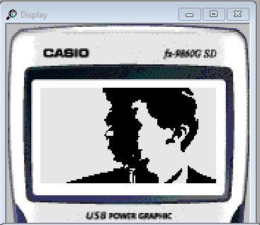
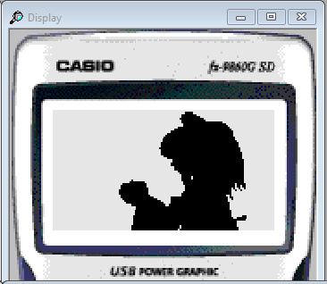

# bvf_play

Add-In for the Casio fx-9860GII to play BVF video files. Looks for a file named `output.bvf` in the storage memory to play.

Images are from the SDK emulator but it works the same on the real device.

## Installation

Download the Add-In file `BVFPLAY.G1A` from the [Releases](https://github.com/kizza7984/bvf_play/releases) and install it. The easiest way to do this is to connect the calculator as a storage device via USB cable, then place the file in the root directory of the storage memory.
